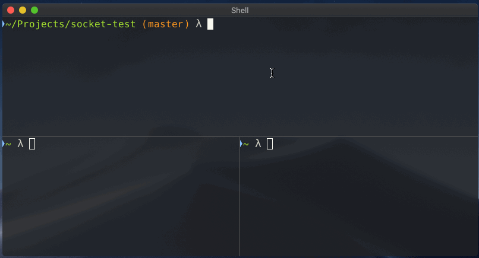

# socket-test

Playing around with Node's `net` server via UNIX domain sockets.

## Try it out

```bash
# clone this repo
git clone https://github.com/thebearingedge/socket-test && \
cd socket-test

# install nodemon
npm install

# try it out
npm run dev

# (JR) or...
node index.js
node index2.js
```
A domain socket will be created at `/tmp/test.sock`. You can connect to it with `netcat`.

# run netcat from 2 or more seperate terminal windows, or use eg tmux
```
nc -U /tmp/test.sock
```

<p align="middle">
  
</p>
